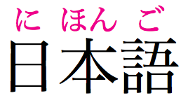
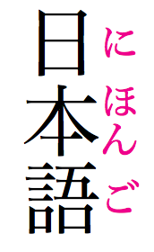
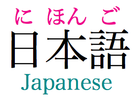
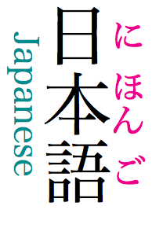

ルビ
=======

ルビは文字の傍に配置される、読みや説明などの役割を果たす小さな文字のことです。ルビを付けられる側の文字を親文字（base text）といいます。





19世紀後半、イギリスの活版印刷では活字の大きさを宝石の名前で表現することがありました。ルビーと呼ばれていた5.5ptの大きさの活字は、明治時代の日本に輸入されると、本文の傍に小さく書かれたふりがなや説明に使われるようになります。これがルビという名称の由来といわれています。

ルビの構成要素
------------------

ルビに使われる要素には次の種類があります。

<!--
- ruby
- rb
- rt
- rtc
- rp
-->

|要素     | 説明 |
|--------|------|
|`ruby` | ルビと親文字のまとまりを表す要素です。 |
|`rb` | 親文字を表します。 |
|`rt` | ルビを表します。 |
|`rtc` | ひとつの親文字に対して２つのルビを付ける場合に、ルビをrtc要素に入れてグループ化することができます。|
|`rp` | ルビをサポートしないブラウザ向けのフォールバックを提供します。 |

ruby要素の内容には次のルールがあります。

- 1つ以上の親文字にあたるフレージングコンテンツ、またはそれを内容とするrb要素を持つこと
- 1つ以上のrt要素、またはrtc要素を持つこと
- rp要素を持つ場合、rp要素はrt要素またはrtc要素の直前または直後に記述すること


シンプルなルビのマークアップ例を示します。

```html
<ruby>日本語<rt>にほんご</ruby>
```

rt要素に後続のコンテンツがない場合、終了タグは省略できます。また、rt要素の後にrb、rt、rtc、rp要素がくる場合も省略できます。終了タグを明示的に記述する場合は次のようなマークアップになります。


```html
<ruby>日本語<rt>にほんご</rt></ruby>
```

これまでの例では、「日本語」は暗黙的に親文字とみなされています。rb要素によって明示的に親文字を示すこともできます。rb要素を利用すると、CSSセレクタによって親文字だけにレイアウトを指定するのに役立ちます。

```html
<ruby><rb>日本語</rb><rt>にほんご</rt></ruby>
```

rb要素もまた後続のコンテンツがない場合、終了タグを省略できます。また、rb要素の後にrb、rt、rtc、rp要素がくる場合も省略できます。

```html
<ruby><rb>日本語<rt>にほんご</ruby>
```

次のセクションでは、上記の例では触れてこなかったrtc要素やrp要素も交えながら、ルビの様々なマークアップ方法を紹介します。

ルビの種類とマークアップ方法
------------------------------------

### モノルビ

親文字の1字ごとに対応してルビを付ける方法を**モノルビ**といいます。これは次のようなマークアップで表現できます。

```html
<ruby>日<rt>に</ruby><ruby>本<rt>ほん</ruby><ruby>語<rt>ご</ruby>
```

### グループルビ

複数の親文字で構成される語全体にルビを付ける方法を**グループルビ**といいます。これは次のようなマークアップで表現できます。

```html
<ruby>今日<rt>きょう</ruby>
```

ブラウザのレンダリングにおいて、グループルビの1行の中にひとまとまりとして扱われます。途中で改行されることはありません。

### 熟語ルビ

熟語ルビはモノルビともグループルビとも異なる挙動を示すルビの呼称です。必ずしも日本語の熟語に付けられたルビを指すものではありません。

熟語ルビはモノルビと同様に親文字とルビを対応させて記述できますが、ルビが複数の親文字にまたがるようにレンダリングされるのが一般的です。

次の例では、親文字とルビがそれぞれ３つのペアを構成しています。

```html
<ruby>法<rb>華<rb>経<rt>ほ<rt>け<rt>きょう</ruby>
```

### インラインルビ

ルビをサポートしないブラウザでは親文字とルビが一列に並んで表示されます。また、ルビを表示するのに十分な行高がない場合に、同様のインライン化をすることがあります。

ルビをサポートしないブラウザのためのフォールバック手段としてrp要素があります。rp要素の内容テキストはルビのをサポートしないブラウザでのみ表示されるので、括弧をなどの文字を入れることで、ルビを本文と区別できます。次のマークアップはルビをサポートしないブラウザでは「日本語（にほんご）」と表示されます。

```html
<ruby>日本語<rp>（<rt>にほんご<rp>）</ruby>
```

モノルビや熟語ルビをマークアップする際には親文字とルビの並び順に注意します。

```html
<ruby>日<rp>（<rt>に<rp>）<rb>本<rp>（<rt>ほん<rp>）<rb>語<rp>（<rt>ご<rp>）</ruby>
```

上記の例は、フォールバック時に「日（に）本（ほん）語（ご）」と表示されます。このマークアップは読みやすいとはいえません。

```html
<ruby>日<rb>本<rb>語<rp>（<rt>に<rt>ほん<rt>ご<rp>）</ruby>
```

上記の例は、フォールバック時に「日本語（にほんご）」と表示されます。こちらのマークアップは親文字とルビがグループ化されているので読みやすいです。

### 両側ルビ

稀に親文字に対して２つのルビを付けることがあります。このようなケースでは、ルビを親文字の上下（横書き）または左右（縦書き）に配置するのが一般的です。親文字の両側にルビが付くので両側ルビと呼ばれます。





２つのルビを付けるには、rtc要素を利用してそれぞれのルビを区別します。次の例では親文字に対してふりがなと英語での表記という２種類のルビを付けています。

```html
<ruby>日本語<rt>にほんご<rtc>Japanese</ruby>
```

言語属性を付与すれば英語のテキストであることを明示できます。

```html
<ruby>日本語<rt>にほんご<rtc lang="en">Japanese</ruby>
```

両側ルビとしてレンダリングするには、ルビの位置を指定するCSSのプロパティ ruby-position を使います。次の例では言語属性が英語（en）のrtc要素を下に（縦書きでは左に）配置するように指定しています。

```css
rtc:lang(en) {
  ruby-position: under;
}
```

ruby-postion はルビのレイアウトを定義するCSSのモジュール [CSS Ruby Layout Module Level 1](http://www.w3.org/TR/css-ruby-1/) が定義するプロパティです。このプロパティには次の値があります（本稿の値は W3C [Working Draft, 5 August 2014](http://www.w3.org/TR/2014/WD-css-ruby-1-20140805/)を参照しています）。

|値     | 説明 |
|--------|------|
|`over` | 親文字が横書きの時にルビを上に配置します。 |
|`under` | 親文字が横書きの時にルビを下に配置します。 |
|`inter-character` | 親文字が横書きの時にルビをそれぞれ対応関係にある親文字の右に縦書きで配置します。主に台湾で使われる注音符号（Bopomofo）に用いられます。 |
|`right` | 親文字が縦書きの時にルビを右に配置します。|
|`left` | 親文字が縦書きの時にルビを左に配置します。 |

なおこれまで紹介したマークアップとCSSプロパティは、本稿執筆時点では、すべてのブラウザでサポートされているものではありません。利用に際しては実装状況を確認するようにしてください。
